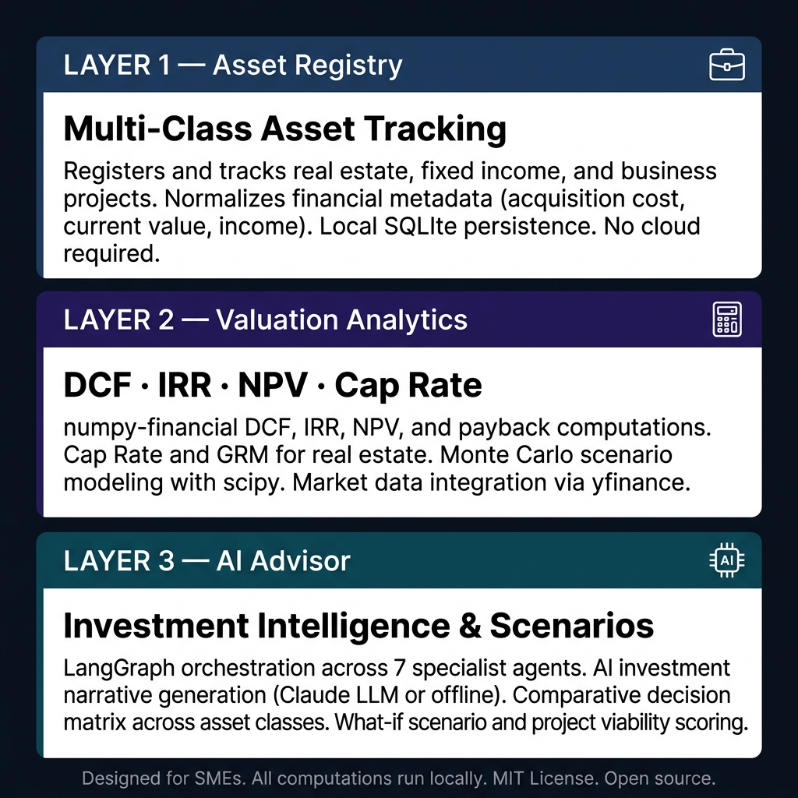
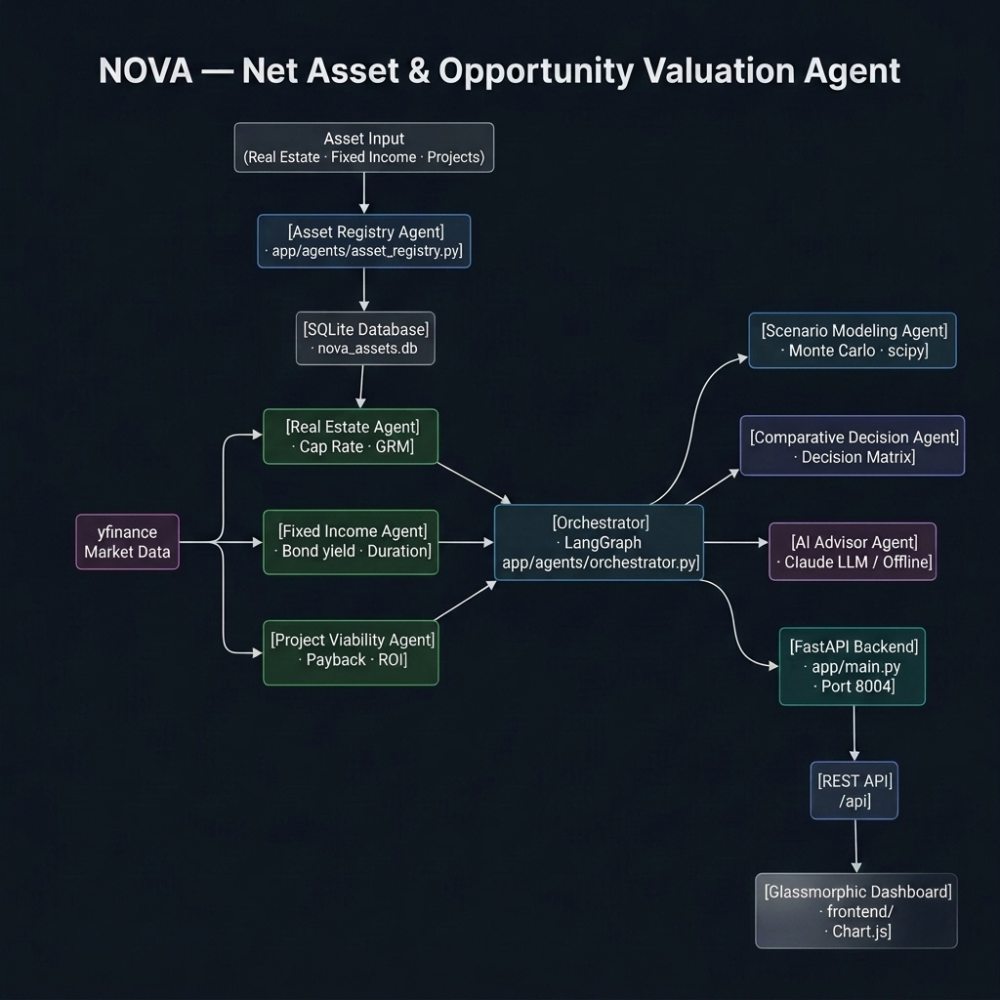
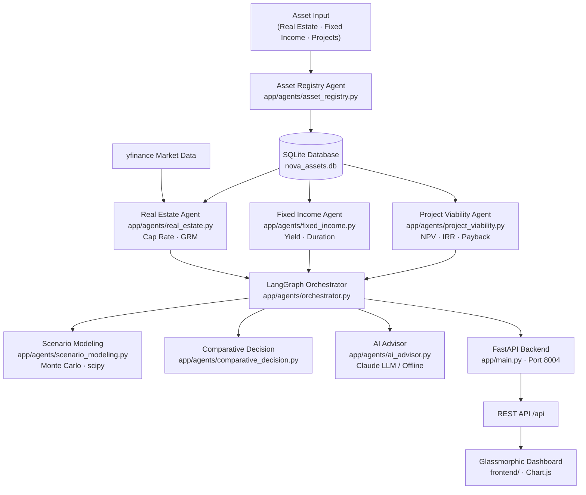

# NOVA — Net Asset & Opportunity Valuation Agent

[](https://opensource.org/licenses/MIT)
[](https://www.python.org/)
[](https://fastapi.tiangolo.com/)
[](https://github.com/langchain-ai/langgraph)
[](https://numpy.org/numpy-financial/)
[](https://airc.nist.gov/RMF)

> **An open-source asset valuation and investment intelligence agent for SMEs — DCF, IRR, NPV, Cap Rate, Monte Carlo scenario modeling, and AI-driven investment advisory across real estate, fixed income, and business projects.**

NOVA is an open-source net asset and opportunity valuation agent. It registers multi-class asset portfolios, computes rigorous financial metrics (DCF, IRR, NPV, Cap Rate, Payback), models investment scenarios with Monte Carlo simulation, and delivers AI-generated investment narratives — all running locally through a seven-agent LangGraph orchestration layer.

---

## How It Works — Three Integrated Layers



### Layer 1 — Asset Registry

Accepts multi-class asset inputs: real estate properties, fixed income instruments, and business projects. Normalizes financial metadata — acquisition cost, current market value, income streams, depreciation schedules. Persists all records to a local SQLite database with zero cloud dependency.

```
Input:  Real estate · fixed income · business project data
Output: Normalized asset records — registered, classified, persisted to SQLite
```

### Layer 2 — Valuation Analytics

Runs asset-class-specific financial computations using `numpy-financial` and `scipy`. Real estate: Cap Rate, GRM (Gross Rent Multiplier), appreciation modeling. Fixed income: bond yield, duration, convexity. Projects: NPV, IRR, Payback Period, ROI. Enriches computations with live market data via `yfinance`. Runs Monte Carlo scenario simulations for uncertainty quantification.

```
Input:  Asset portfolio records + market data
Output: DCF · IRR · NPV · Cap Rate · Monte Carlo scenario bounds
```

### Layer 3 — AI Advisor

LangGraph orchestrates seven specialist agents across asset classes and decision types. Generates natural language investment narratives using Anthropic Claude (or offline rule-based heuristics). Produces comparative decision matrices across asset classes. Scores project viability and models what-if scenarios on demand.

```
Input:  Computed valuations + scenario models
Output: Investment narrative · comparative analysis · project viability score · what-if scenarios
```

---

## Technical Architecture





### REST API Surface

| Endpoint | Method | Description |
|---|---|---|
| `/api/assets` | `GET / POST` | List or register assets (real estate · fixed income · project) |
| `/api/analysis` | `GET / POST` | Run valuation analysis for a specific asset |
| `/api/compare` | `POST` | Comparative decision matrix across multiple assets |
| `/api/system` | `GET` | System status, AI mode (`llm` or `offline`), version |

### Stack

| Component | Technology |
|---|---|
| Backend | FastAPI 0.115 (Python 3.11+) |
| Agent Orchestration | LangGraph 0.2.39 · LangChain 0.3.7 |
| Financial Math | numpy-financial · scipy · pandas · numpy |
| Market Data | yfinance 0.2.43 |
| AI Narrative | Anthropic Claude (optional) · offline heuristics fallback |
| Database | SQLite (zero-server, local-first) · SQLAlchemy |
| Dashboard | HTML + CSS + JavaScript · Chart.js |
| Testing | pytest · pytest-asyncio · httpx |

---

## Key Design Decisions

**Rigorous financial math, not estimates.** Every valuation uses deterministic financial formulas (`numpy-financial`) — DCF cash flows, IRR iteration, bond duration — not LLM-generated numbers. The AI advisor only narrates results it did not compute.

**Monte Carlo, not single-point projections.** Scenario modeling uses scipy-based Monte Carlo simulation to produce probability distributions over outcomes, not optimistic single-point forecasts.

**Seven specialist agents, one orchestrator.** LangGraph routes each asset type and decision task to the appropriate specialist agent, enabling modular expansion without architectural changes.

**Zero-server dependency.** SQLite requires no database server. The full valuation engine starts with `python run.py`.

**NIST AI RMF 1.0 alignment.** AI-generated investment narratives are logged with a clear separation from mathematically computed valuations, following NIST principles of transparency, explainability, and human oversight.

---

## Who Is This For?

NOVA is built for SME owners, CFOs, real estate investors, and financial advisors who need rigorous asset valuation without enterprise software costs.

**You do not need a financial engineering background.** Register your assets, configure your scenarios, and run `python run.py`. NOVA handles the math, modeling, and narrative automatically.

---

## Quickstart

```bash
git clone https://github.com/afild/NOVA.git
cd NOVA
pip install -r requirements.txt
python run.py
```

Open `http://localhost:8004/static/index.html` in your browser.

---

## AI Modes

**LLM Mode:**

```bash
export ANTHROPIC_API_KEY=your_key_here   # Linux/macOS
set ANTHROPIC_API_KEY=your_key_here      # Windows
python run.py
```

**Offline Mode** (default): All financial computations (DCF, IRR, NPV, Monte Carlo) operate identically. The AI advisor generates structured narratives using deterministic rule-based analysis.

---

## Getting Started

### Prerequisites
- Python 3.11 or higher
- Git

### Installation

```bash
git clone https://github.com/afild/NOVA.git
cd NOVA
python -m venv venv
source venv/bin/activate   # Windows: venv\Scripts\activate
pip install -r requirements.txt
cp .env.example .env
python run.py
```

### Running Tests

```bash
pytest tests/ -v
```

---

## NIST AI RMF 1.0 Alignment

| NIST Function | NOVA Implementation |
|---|---|
| **GOVERN** | MIT License · computation-first AI narrative architecture · traceable agent decisions |
| **MAP** | Investment domain scoped to SME asset classes · documented formula assumptions |
| **MEASURE** | pytest suite · Monte Carlo confidence bounds · IRR convergence validation |
| **MANAGE** | Offline fallback · deterministic math separated from AI narrative · explainable scenarios |

The AI Advisor receives only computed valuation outputs (numerical results) — never raw asset data or market API responses.

---

## Repository Structure

```
NOVA/
├── app/
│   ├── main.py                        ← FastAPI app · lifespan · static serving
│   ├── config.py                      ← Pydantic settings
│   ├── agents/
│   │   ├── orchestrator.py            ← LangGraph orchestration across 7 agents
│   │   ├── asset_registry.py          ← Asset classification and registration
│   │   ├── real_estate.py             ← Cap Rate · GRM · appreciation
│   │   ├── fixed_income.py            ← Bond yield · duration · convexity
│   │   ├── project_viability.py       ← NPV · IRR · Payback · ROI
│   │   ├── scenario_modeling.py       ← Monte Carlo · scipy · uncertainty bounds
│   │   ├── comparative_decision.py    ← Cross-class decision matrix
│   │   └── ai_advisor.py              ← Investment narrative (Claude + offline)
│   ├── api/
│   │   ├── router.py
│   │   ├── assets.py
│   │   ├── analysis.py
│   │   ├── compare.py
│   │   └── system.py
│   ├── database/
│   │   ├── db_manager.py
│   │   └── schema.sql                 ← Tables: assets · valuations · scenarios
│   └── services/
│       ├── finance_math.py            ← numpy-financial computations
│       └── market_data.py             ← yfinance integration
├── docs/
│   └── images/                        ← Architecture diagrams
├── frontend/
│   ├── index.html                     ← Glassmorphic dashboard
│   ├── styles.css
│   └── app.js                         ← Chart.js · API integration
├── tests/
│   ├── conftest.py
│   ├── test_agents.py
│   ├── test_api.py
│   └── test_math.py
├── .env.example
├── requirements.txt
└── run.py
```

---

## Contributing

Areas where contributions are most needed:
- Additional asset classes (private equity, commodities, crypto)
- Integration with real estate MLS data APIs
- Discounted cash flow sensitivity analysis dashboard
- Docker Compose setup for zero-dependency deployment

---

## Changelog

### Latest: v0.1.0
- Full valuation pipeline: asset registry, financial computation, scenario modeling, AI advisor

---

## License

MIT License — free to use, adapt, and redistribute.
